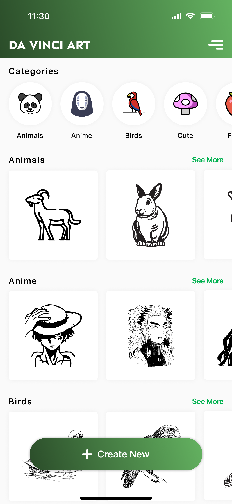
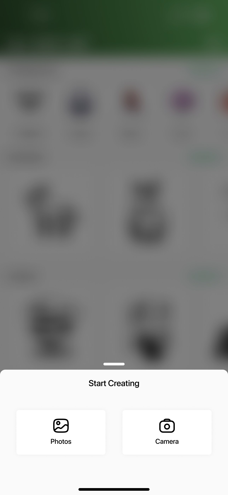

# AR Drawing App

**AR Drawing App** is a tool that uses augmented reality (AR) technology to overlay drawings on top of the camera view. It is designed to help users draw with precision by providing a real-time guide. This app is built with **Flutter** and uses **SQLite** for local data storage.

## Features

- **AR Drawing:** Use AR to project drawings onto a real-world surface via the camera.
- **Custom Drawings:** Choose from preloaded images or upload your own to use as a drawing guide.
- **User-Friendly Interface:** Controls for positioning, scaling, and rotating the guide image.
- **Offline Capability:** SQLite integration ensures that all data is stored locally.
- **Real-Time Interaction:** Manipulate the AR image to align perfectly.

## Technologies Used

- **Flutter**: The app is built using Flutter for cross-platform compatibility (iOS and Android).
- **SQLite**: For local storage of user data and drawings.
- **ARCore / ARKit**: Depending on the platform (Android or iOS), the app leverages ARCore or ARKit for augmented reality functionality.

## Installation

1. Clone the repository:
   ```bash
   git clone https://github.com/myndaaa/AR-Drawing-Application.git
   ```
2. Install dependencies:
    ```
       flutter pub get
    ```
   Run the app
    ```
     flutter run
    ```


## Development
- [x] Category ribbon
- [ ] Side bar
- [ ] local db created via sqlite 
- [ ] data model created to store svgs
- [ ] bottom slide drawer created
- [ ] list of categories populated
- [ ] remove background implemented
- [ ] save template after removing background
- [ ] camera view created
- [ ] camera view with AR created


### Contributors
* Designers: GH Bandhan, Shahriar Sadat
* Developer: Myndaaa :heart: 🦄 👽


## For me to see and refer to
<div style="display: flex; justify-content: space-between;">
  
  
</div>


